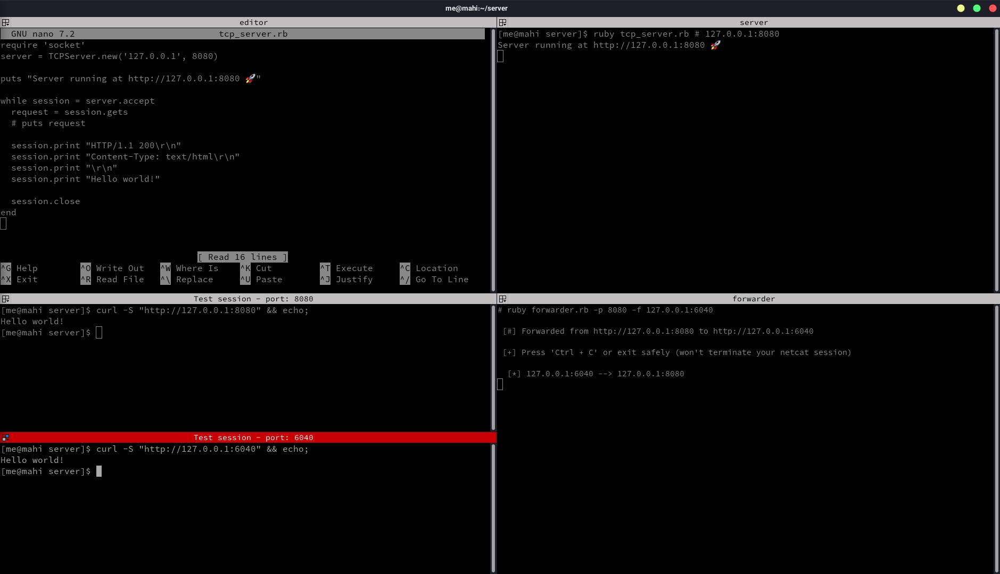

## Port Forwarder



port-forward forwards(obviously) an incomming TCP connection on a specific port to another local/remote port

> [!Note]
> Press 'Ctrl + C' or exit safely (won't terminate your netcat session)

Support all OS's if ruby installed

## Usage
```bash
ruby port-forwarder.rb -p [local-port] -f [forward-host]:[forward-port]
```

### Example:
```bash
ruby port-forwarder.rb --local-port 80 --forward 192.168.0.236:6060
```

 OR

```bash
ruby port-forwarder.rb -p 80 -f 192.168.0.236:6060
```

### Arguments

   |   argument    |     default     | utilization |
   | ------------- | --------------- | ----------- |
   | `--local-port` or `-p` |  | required |
   | `--forward` or `-f` | [ip]:[port] | optional |
   | `--help` or `-h` |  | optional |